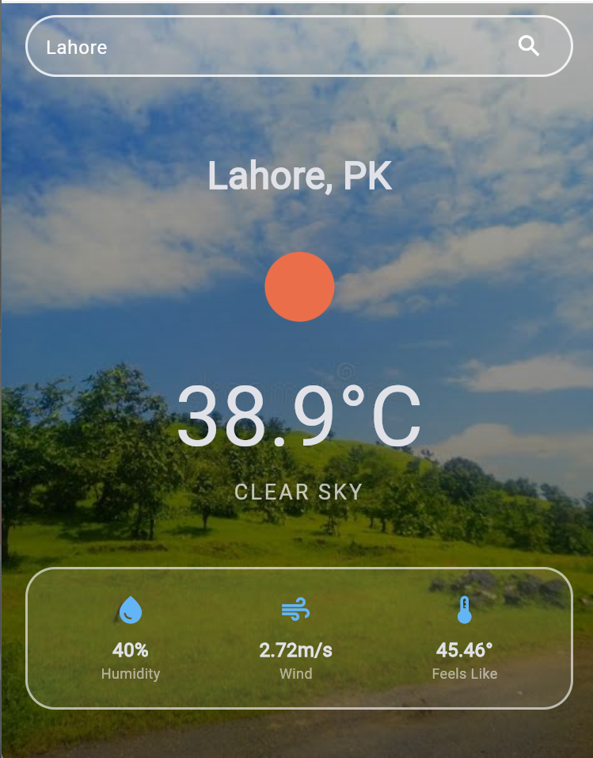

# 🌤️ Flutter Weather App

A beautiful, responsive weather application built with Flutter that provides real-time weather updates and features a dynamic UI that changes with the time of day.

## 🚀 Features

- **Real-time Weather Data**: Fetches current weather conditions (temperature, humidity, wind speed, etc.) using the [OpenWeatherMap API](https://openweathermap.org/api).
- **Dynamic Backgrounds**: The app's background automatically switches based on the current time of day to provide a contextual experience.
- **Animated Transitions**: Smooth transitions between background images using `AnimatedSwitcher`.
- **City Search**: Search for weather information for any city worldwide.
- **Glassmorphism Design**: Modern UI with semi-transparent overlays and blurred containers.
- **Pull-to-Refresh**: Easily update weather data with a swipe gesture.
- **Secure Configuration**: Uses `flutter_dotenv` to keep API keys safe.

## 📸 Screenshots

<p align="center">
  
</p>

## 🛠️ Built With

- **Flutter**: Cross-platform UI toolkit.
- **OpenWeather API**: Professional weather data provider.
- **http**: For handling network requests.
- **flutter_dotenv**: For environment variable management.

## 📦 Getting Started

### Prerequisites

- [Flutter SDK](https://docs.flutter.dev/get-started/install) (latest stable version recommended).
- An API Key from [OpenWeatherMap](https://home.openweathermap.org/users/sign_up).

### Installation

1. **Clone the repository:**
   ```bash
   git clone <repository-url>
   cd weather_app
   ```

2. **Install dependencies:**
   ```bash
   flutter pub get
   ```

3. **Configure Environment Variables:**
   Create a `.env` file in the root of the project:
   ```env
   OPENWEATHER_API_KEY=your_api_key_here
   ```

4. **Prepare Assets:**
   Ensure the following images are in your `assets/images/` directory:
   - `morning_image.jpg`
   - `aftarnoon_image.jpg`
   - `evening_image.jpg`
   - `night_images.jpg`

5. **Run the application:**
   ```bash
   flutter run
   ```

## 📂 Project Structure

- `lib/main.dart`: The core of the application containing UI logic, state management, and API calls.
- `assets/images/`: Stores time-based background images.
- `screenshots/`: App preview images.
- `.env`: (Ignored by Git) Contains sensitive configuration data.

## 📝 License

This project is open-source and available under the [MIT License](LICENSE).
